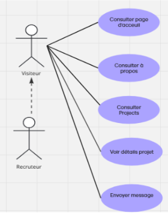
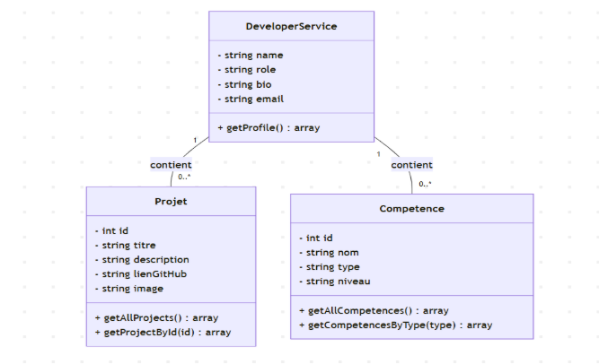

# Developer Portfolio Mini-Site
**Salma Akajou**  
*Encadré par : M. Essarraj Fouad*  
*Groupe: DM101*

---

## Analyse : Cahier de charge
- **Cliente**: 
Yousra Akajou
- **Objectif**: 
Créer un mini-site pour exposer ses compétences et ses projets 
- **Pages minimales**: -Accueil                                                                                     
-Projets                                                                                    
-Détail projet                                                                              
- À propos / Contact  
- **Technologies**: 
- Laravel                                                 
- blades (views)       
- Css frameworks: Bootstrap 5,ou Tailwind CSS
- **Contraintes**: 
 - Données statiques (pas BDD)                                                  
 - Code propre et clair                                                                     
 - Design simple et uniforme          

---

## Analyse: Example de l'exsistant

---

## Analyse: Diagramme de cas d'utilisation

---

## Conception: Schema

---

## Conception: Diagramme de classe

---

## Conception: Maquette

